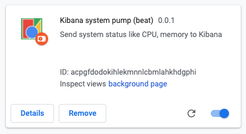
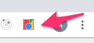

# Kibana browser performance test monitor

An experiment using [Kibana](https://www.elastic.co/kibana) to monitor Chrome browser performance as part of application testing. 


It contains a dockerised version of Kibana 7.7.0 and a chrome browser extension that sends system cpu, browser performance data and websocket frequency data to Kibana.

The extension uses the [chrome devtools-protocol](https://chromedevtools.github.io/devtools-protocol/) to interact with the browsers debugger.

## Instructions

### 1. Spin up Kibana
 
``` bash
docker-compose up
```

Kibana can be accessed from [http://localhost:5601/](http://localhost:5601/)

Elastic can be accessed from [http://localhost:9200/](http://localhost:9200/)

### 2. Add the dashboard to Kibana 

```bash
curl -X POST -H 'Content-Type: application/json' -H 'kbn-xsrf: true' -d @./kibana/dashboard.json http://localhost:5601/api/kibana/dashboards/import
curl -X POST -H 'Content-Type: application/json' -H 'kbn-xsrf: true' -d @./kibana/browsers-dashboard.json http://localhost:5601/api/kibana/dashboards/import
```

You can save any dashboard changes using:

```bash
curl -X GET "localhost:5601/api/kibana/dashboards/export?dashboard=<dashboard-gid>" > your-dashboard.json
``` 


### 3 Add the custom extension to Chrome

The chrome-extension must have permission to post to Kibana. If you change Elastic to run on a specific host, you must update the permissions in the ```manifest.json```.

Build the plugin (into ```dist``` in the ```chrome/extension``` folder):

```bash
cd chrome
yarn start 
``` 

Then:

* Vist ```chrome://extensions/``` in your browser.  
* Toggle the ```Developer mode``` switch on the top right-hand-side.
* Click the ```Load unpacked``` button and and select the ```chrome/extension``` folder.

You should see the ```Kibana system pump (beat)``` extension:
 


### 4 Activate the extension to send data to Kibana

Click the extension icon on when viewing the browser tab you want to monitor.  



This will display a (very ugly) popup informing you that the extension has control of the debugger along with the data being sent.

You can change the browser name (the name is used to identify and filter the results in Kibana) and the Elastic Search URL (where the data is being sent) by double-clicking on the fields.

### 5 View the data on the Dashboard

The ```Browser Performance``` dashboard can be accessed from [http://localhost:5601/app/kibana#/dashboards](http://localhost:5601/app/kibana#/dashboards)

## Other Stuff

### Handy docker commands

* `docker ps -aq -f status=exited` ~ list all your stopped containers using
* `docker rm $(docker ps -aq -f status=exited)` ~ remove all your stopped containers
* `docker rm $(docker ps -a -q)` ~ remove all containers
* `docker volume ls` ~ view all volumes
* `docker volume prune` ~ remove unused volumes

### Handy Elasticsearch links and commands

* ```http://localhost:9200/_cat/indices?v``` - see status, size doc-count of all indexes.
* ```curl -X DELETE http://localhost:9200/browser-cpu``` - remove cpu index
